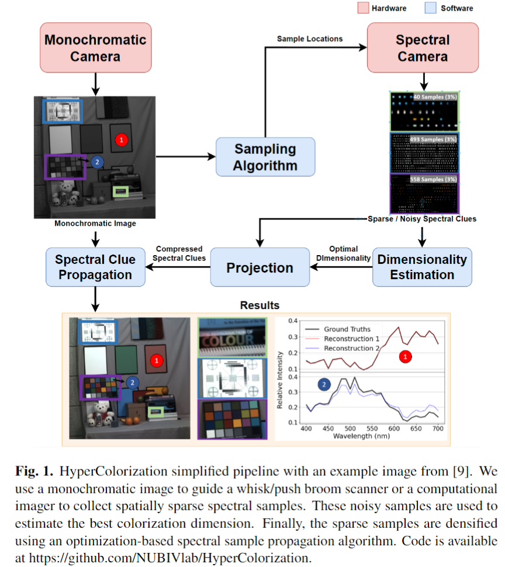

<h1> HyperColorization: Propagating spatially sparse noisy spectral clues over hyperspectral images </h1> 
<b>Abstract</b>: Hyperspectral cameras face challenging spatial-spectral resolution trade-offs and are more affected by shot noise than RGB photos taken over the same total exposure time. Here, we present a colorization algorithm to reconstruct hyperspectral images from a grayscale guide image and spatially sparse spectral clues. We demonstrate that our algorithm generalizes to lower dimensional models for hyperspectral images, and show that colorizing in a low-rank space reduces compute time and the impact of shot noise. To enhance robustness, we incorporate guided sampling, edge-aware filtering, and dimensionality estimation techniques. Our method surpasses previous algorithms in various performance metrics, including SSIM, PSNR, GFC, and EMD, which we propose as valuable metrics for characterizing hyperspectral image quality. Collectively, these findings provide a promising avenue for overcoming the time-space-wavelength resolution trade-off by reconstructing a dense hyperspectral image from samples obtained by whisk or push broom scanners, as well as computational imaging systems. 

  

<h2>Installation </h2>

* Clone this repository to your local machine. Example local path: ../dev/HyperColorization/
* Install [Anaconda]( https://www.anaconda.com/):
* Run Anaconda Prompt as Administrator.
* Navigate to the directory where you cloned this repository with "cd ../dev/HyperColorization/".
* Run: "conda create --name HyperColorization --file requirements.txt".
* Run "conda activate HyperColorization". 
* Open demo.ipynb from your favorite IDE that supports Jupiter notebooks. 
* Select HyperColorization as the interpreter. You should be able to work on the project now! 

<h2> FAQ </h2>

* I am trying to use the KAIST hyperspectral dataset. OpenEXR won't run.
  > You need the binary files of OpenEXR for the Python library to work. If you are on Linux or Mac, follow this [guide](https://openexr.com/en/latest/install.html). On Windows, compiling the binary is more complicated. However, we can still download the precompiled binary. Open Anaconda Prompt as Administrator, and activate your environment. First run: "pip install pipwin". After a successful install, run: "pipwin install openexr".

* Why do I get blue errors close to the edges when colorizing the Bear & Fruit Image?
  > Unfortunately, it's a problem with the data. If you are too annoyed, the best fix is to remove a couple of columns from the left and a couple of rows from the bottom after importing.
